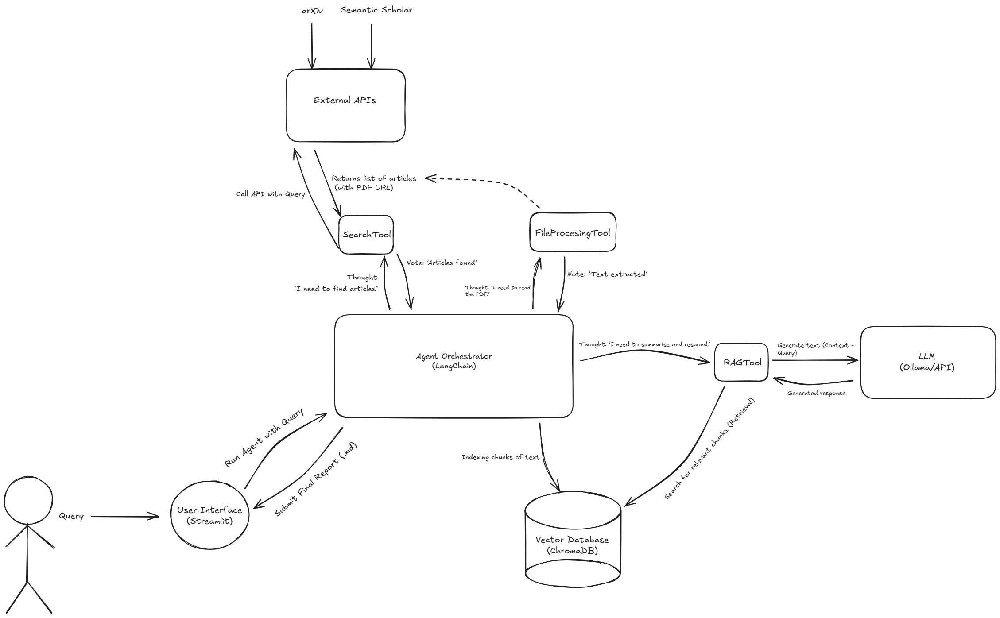

# ScholarAI: An Autonomous Agent for Scientific Literature Review and Synthesis

This project is an autonomous agent that receives a research topic, finds the 3-5 most relevant academic articles, reads their PDFs, and generates a summary report in Markdown format.

## System Architecture

## Specifications
For a detailed description of the input, expected output format, and functional requirements, please refer to the [Detailed Specifications Document](docs/SPECIFICATIONS.md).
