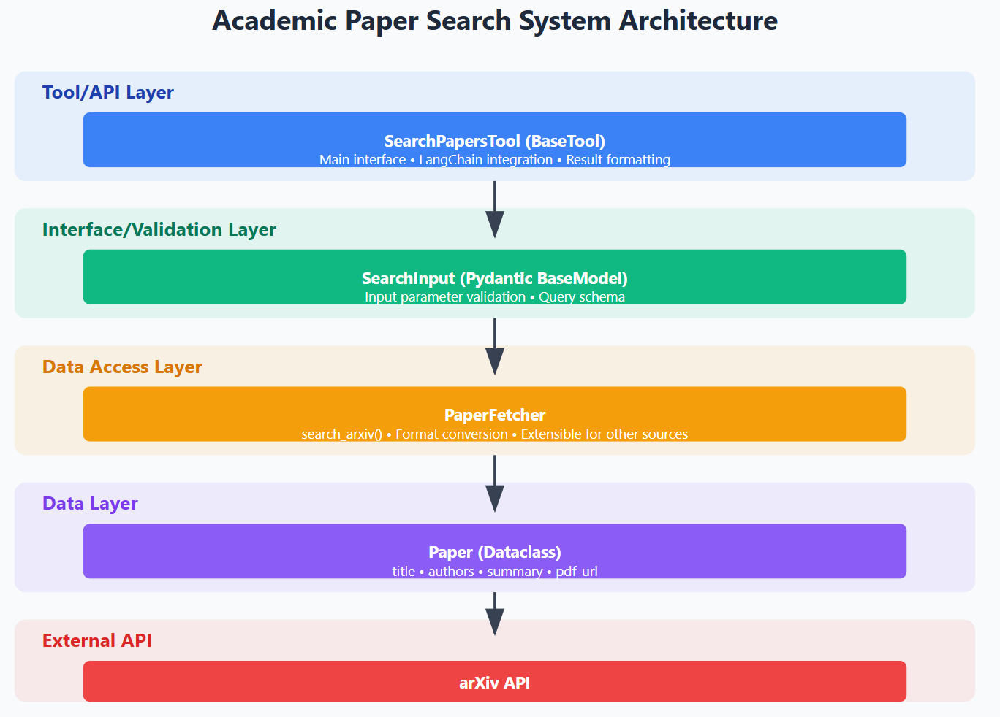
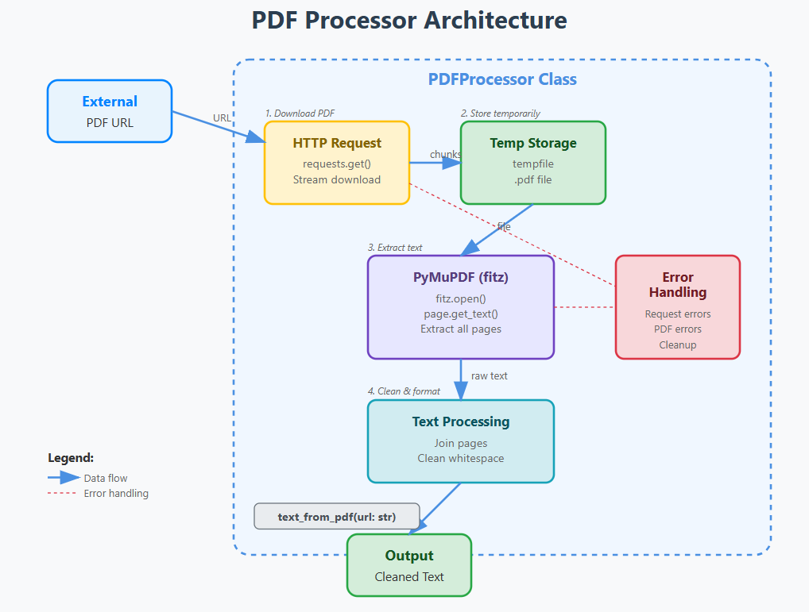
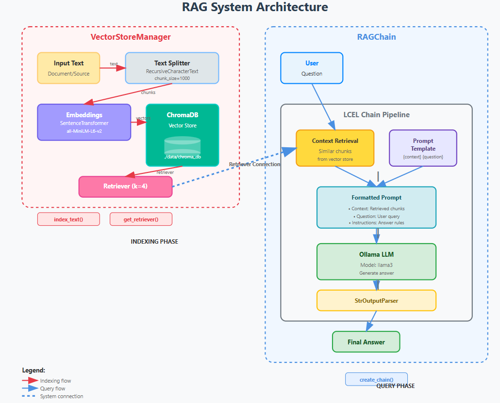
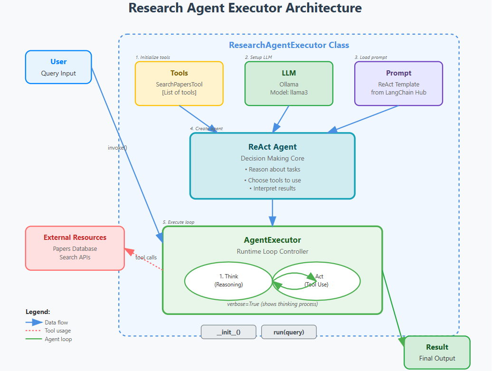

# ScholarAI: An Autonomous Agent for Scientific Literature Review and Synthesis

This project is an autonomous agent that receives a research topic, finds the 3-5 most relevant academic articles, reads their PDFs, and generates a summary report in Markdown format.

## System Architecture

## Specifications
For a detailed description of the input, expected output format, and functional requirements, please refer to the [Detailed Specifications Document](docs/SPECIFICATIONS.md).

## Agent Interface

Built with pure HTML, CSS, and JavaScript, the front end provides a user-friendly experience for academic research. Users can input a research query, select a display format (Card View, Plain Text, or Markdown), and view simulated search results. The interface includes dynamic elements like a loading spinner, search history, and a save function, demonstrating a clean and functional design ready to be integrated with a powerful AI backend.
I used Claude to help me build this!

## Agent Explanation

**src/agent/tools.py**

1 - A LangChain agent receives a user's prompt ("Use this tool to search for academic articles on arXiv on a specific topic.")

2 - The agent, based on its training and the description of SearchPapersTool, decides that this tool is relevant.

3- The agent then looks at args_schema (SearchInput) to understand what arguments the tool expects. It will try to extract the query ("large language models from 2023") from the user's prompt.

4 - The agent calls the _run method of SearchPapersTool with the extracted query.

5 - SearchPapersTool uses PaperFetcher to query arXiv.

6 - PaperFetcher converts the raw arXiv results into Paper objects.

7 - SearchPapersTool formats these Paper objects into a single, readable string.

8 - This string result is returned to the Langchain agent.

9 - The agent can then use this information to formulate a final answer to the user.

**src/processing/parser.py**

1 - Download a PDF from a URL in a streaming fashion, saving it to a temporary file.

2 - Extract all text content from the downloaded PDF using PyMuPDF.

3 - Clean the extracted text by normalizing whitespace (replacing newlines and collapsing multiple spaces).

4 - Handle errors gracefully during download and processing.

5 - Clean up by deleting the temporary PDF file when done.

**src/agent/rag.py**

1 - Index Documents: You would first use VectorStoreManager to load and index your documents (e.g., PDFs, text files). This involves:
    - Splitting the documents into chunks.
    - Generating embeddings for each chunk.
    - Storing these embeddings (and the original text chunks) in the Chroma vector database.
    
2 - Ask a Question: When a user asks a question:
    - The RAGChain receives the question.
    - The retriever (part of the chain) takes the user's question, converts it into an embedding, and searches the Chroma database for the most semantically similar text chunks. These are the "context" documents.
    - The prompt combines the user's question with these retrieved context documents into a well-structured prompt for the LLM.
    - The llm (llama3) then generates an answer, using the provided context as its primary source of information. This significantly reduces the chances of the LLM "hallucinating" and helps ensure the answer is grounded in your specific data.

**src/agent/executor.py**

1 - Initialization: When ResearchAgentExecutor is instantiated, it sets up its LLM, its tools (like SearchPapersTool), and loads the ReAct prompt. It then combines these into an agent and an agent_executor.

2 - User Query: The run method is called with a user's research query (e.g., "Summarize the latest advancements in quantum computing").

3 - Agent Execution Loop (ReAct):
    - The agent_executor sends the query to the LLM (llama3).
    - LLM's Thought: The LLM, guided by the ReAct prompt, thinks about the query. It might determine that to answer this, it needs to search for papers.
    - LLM's Action: The LLM decides to use the SearchPapersTool.
    - LLM's Action Input: It formulates an input for the SearchPapersTool (e.g., "latest advancements in quantum computing").
    - Tool Execution: The agent_executor calls the SearchPapersTool with the specified input.
    - Observation: The SearchPapersTool executes its logic (e.g., performs an actual search) and returns its results (e.g., a list of paper titles and abstracts). This result is the "Observation" for the LLM.
    - Loop Continues: The LLM receives this "Observation." It might then:
    - Thought: Realize it needs to summarize these papers, or perhaps refine the search, or call another tool if available.
    - Action: Decide to use the LLM itself to summarize the observed papers.
    - This cycle (Thought, Action, Observation) continues until the LLM determines it has enough information to formulate a Final Answer.
    
4 - Final Answer: Once the LLM generates a Final Answer, the agent_executor returns it as the output of the run method.

## Testing
First testing session: tools.py

Found 3 papers in arXiv about 'transformer models'.
--- Article 1 ---
Title: Model Validation in Ontology Based Transformations
Authors: Jesús M. Almendros-Jiménez, Luis Iribarne
URL of PDF: http://arxiv.org/pdf/1210.6111v1

--- Article 2 ---
Title: A Mathematical Model, Implementation and Study of a Swarm System
Authors: Blesson Varghese, Gerard McKee
URL of PDF: http://arxiv.org/pdf/1310.2279v1

--- Article 3 ---
Title: Towards Lightweight Transformer via Group-wise Transformation for Vision-and-Language Tasks
Authors: Gen Luo, Yiyi Zhou, Xiaoshuai Sun, Yan Wang, Liujuan Cao, Yongjian Wu, Feiyue Huang, Rongrong Ji
URL of PDF: http://arxiv.org/pdf/2204.07780v1

Second testing session: parser.py

Found 3 papers in arXiv about 'transformer models'.

--- Processing Article 1: Model Validation in Ontology Based Transformations ---
Uploading the PDF: http://arxiv.org/pdf/1210.6111v1...
Download finished. Extracting text...
Text extraction concluded.

--- Sample of extracted text (first 500 car.) ---
J. Silva and and F. Tiezzi (Eds.): Workshop on Automated Specification and Verification of Web Systems (WWV 2012) EPTCS 98, 2012, pp. 17–30, doi:10.4204/EPTCS.98.4 c⃝Jess´us M. Almendros-Jim´enez & Luis Iribarne This work is licensed under the Creative Commons Attribution License. Model Validation in Ontology Based Transformations∗ Jes´us M. Almendros-Jim´enez jalmen@ual.es Dpto. de Lenguajes y Computaci´on Universidad de Almer´ıa 04120-Spain Luis Iribarne luis.iribarne@ual.es Dpto. de Lenguajes y .

Thirth testing session: All together (Integrated Pipeline)

Found 3 papers in arXiv about 'transformers models'.

--- Processing article 1/3: Model Validation in Ontology Based Transformations ---
Uploading the PDF: http://arxiv.org/pdf/1210.6111v1...
Download finished. Extracting text...
Text extraction concluded.
Text from the article saved at: data\Model Validation in Ontology Based Transformations.txt

--- Processing article 2/3: A Mathematical Model, Implementation and Study of a Swarm System ---
Uploading the PDF: http://arxiv.org/pdf/1310.2279v1...
Download finished. Extracting text...
Text extraction concluded.
Text from the article saved at: data\A Mathematical Model Implementation and Study of a Swarm System.txt

--- Processing article 3/3: Towards Lightweight Transformer via Group-wise Transformation for Vision-and-Language Tasks ---
Uploading the PDF: http://arxiv.org/pdf/2204.07780v1...
Download finished. Extracting text...
Text extraction concluded.
Text from the article saved at: data\Towards Lightweight Transformer via Groupwise Transformation for VisionandLanguage Tasks.txt

Fourth testing session: Executor.py

